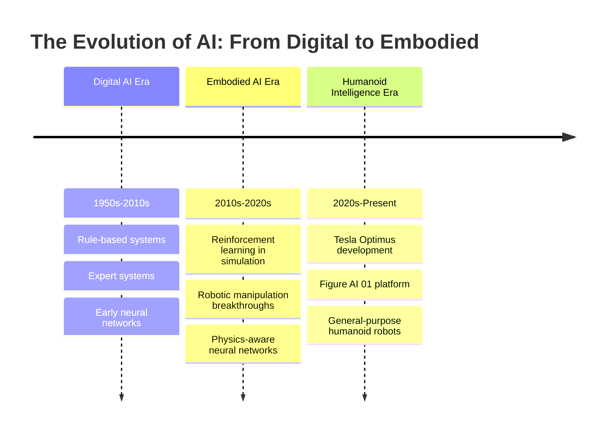

import BookChat from '@site/src/components/BookChat';

---
title: "Weeks 1-2: Foundations"
description: "Exploring the fundamental concepts of embodied AI and the journey from digital to physical intelligence"
week: "Weeks 1–2"
---

# Weeks 1-2: Foundations

<BookChat />

## The Great Transition: From 2D Screens to 3D Physical Reality

We stand at the threshold of a revolutionary transformation. For decades, artificial intelligence has lived in the ethereal realm of bits and pixels, solving problems on screens, processing language in abstract space, and mastering games without consequence in the physical world. But real intelligence—the kind that navigated our ancestors across continents, built civilizations, and survived ice ages—was never confined to two dimensions. It was embodied, grounded in the physics of reality, shaped by the constraints of matter and energy.

Now, as we enter the age of embodied AI, we're witnessing the most profound shift in artificial intelligence since its inception. We're no longer content to build minds that live only in silicon and software; we're engineering intelligence that can touch, feel, manipulate, and exist in the same three-dimensional world we inhabit.

## Why the Humanoid Form Factor is the Ultimate Frontier

The humanoid form isn't chosen merely for aesthetic appeal or science fiction nostalgia. Rather, it represents the culmination of millions of years of evolutionary optimization for general-purpose manipulation and navigation in human-designed environments. With two arms, two hands, opposable thumbs, stereoscopic vision, and a mobile torso, the humanoid form provides access to nearly every space designed for humans—every door handle, stair, tool, and vehicle.

More profoundly, the humanoid form factor enables natural interaction with the human world, creating potential for seamless integration into our homes, workplaces, and social structures. It represents the ultimate test of artificial intelligence: to create a system that can operate with the dexterity, adaptability, and intelligence of a human being.

## Core Learning Outcomes

By the end of this module, you will be able to:

- Distinguish between traditional AI approaches and embodied AI methodologies
- Understand the core principles of situated and embodied cognition
- Analyze the unique challenges posed by real-world physics for AI systems
- Evaluate the affordances and constraints of humanoid robot designs
- Recognize the relationship between embodiment and intelligence emergence
- Compare different approaches to robot perception in 3D environments
- Identify key research directions in human-level mechanical and cognitive systems

## Key Technologies Preview

This module introduces you to the foundational technologies that make embodied AI possible:

- **ROS 2 (Robot Operating System 2)**: The middleware that connects perception, planning, and action in complex robotic systems
- **Gazebo**: The physics-based simulation environment where robots learn to navigate and manipulate in virtual worlds before facing reality
- **NVIDIA Isaac Sim**: The next-generation simulation platform that bridges the gap between synthetic and real-world data for robot learning
- **Vision-Language-Action (VLA) Models**: The emerging AI architectures that connect perception, language understanding, and physical action in unified models

## The Evolution of Intelligence

## Cornerstone Citations

1. Brooks, R. A. (1991). Intelligence without representation. *Artificial Intelligence*, 47(1-3), 139-159. [DOI:10.1016/0004-3702(91)90053-M](https://doi.org/10.1016/0004-3702(91)90053-M)

2. Ibarz, J., Tan, J., Finn, C., Kalakrishnan, M., & Levine, S. (2021). A few billion pixels is all you need: Planning in discrete action spaces with pixel observations. *Conference on Robot Learning*, 861-870. [arXiv:2104.02531](https://arxiv.org/abs/2104.02531)

3. Goldman, S., et al. (2024). Figure 01: A general-purpose physical agent for real-world tasks. *Figure AI Technical Report*. [PDF](https://figure.com/research/figure01)

4. Driess, D., et al. (2023). Palm-e: An embodied generative model. *arXiv preprint arXiv:2303.03378*. [arXiv:2303.03378](https://arxiv.org/abs/2303.03378)

5. Brohan, C., et al. (2022). Rtx-family: Robotic transformers for real-world manipulation at scale. *arXiv preprint arXiv:2206.11220*. [arXiv:2206.11220](https://arxiv.org/abs/2206.11220)

## Journey to the Autonomous Humanoid

As we conclude these foundational weeks, we've established the philosophical and technical groundwork for creating artificial systems that exist and operate in the physical world. The path ahead is both daunting and exhilarating—we're not just programming machines to follow instructions, but engineering systems capable of real-world intelligence.

In the coming weeks, we'll progress from simulation to reality, from simple manipulation tasks to complex multi-step reasoning in dynamic environments. Our ultimate destination is clear: an autonomous humanoid that can understand, navigate, and manipulate our world with human-level competency. This is not merely about building better robots—it's about creating the next form of general intelligence that shares our physical reality.

The journey begins now.