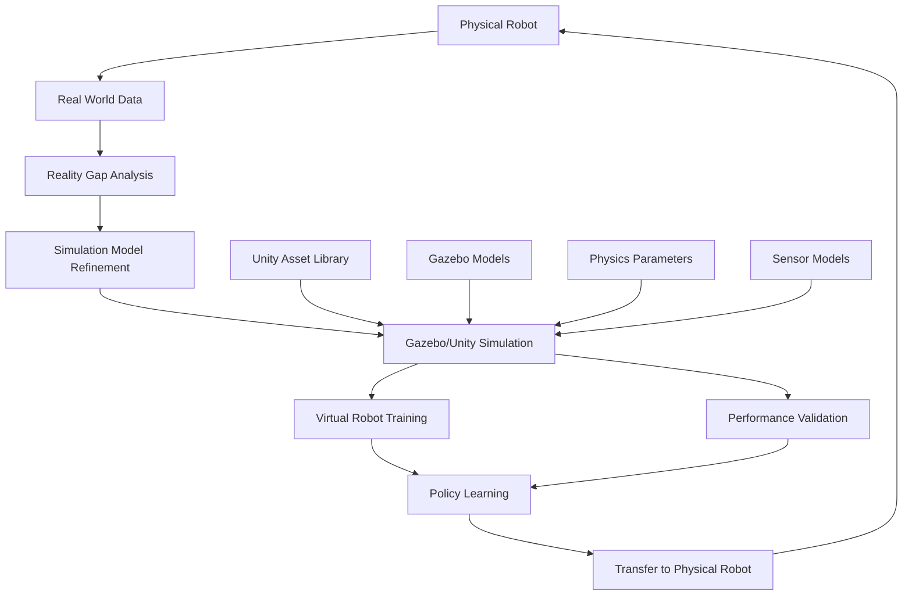

import BookChat from '@site/src/components/BookChat';

---
title: "Weeks 6–7 – Digital Twins: Gazebo & Unity Simulation"
description: "Creating virtual environments for robot development and testing with physics-accurate simulation"
week: "Weeks 6–7"
---

# Weeks 6–7 – Digital Twins: Gazebo & Unity Simulation

<BookChat />

## The Virtual Laboratory: Where Robots Learn Before They Live

In the physical world, failure is expensive, time-consuming, and sometimes dangerous. A robot that falls down a flight of stairs in reality might be damaged beyond repair, requiring weeks of repairs and thousands of dollars in replacement parts. But in the digital realm of simulation, failure becomes a learning opportunity rather than a catastrophe. Here, in the virtual laboratory of digital twins, robots can stumble, crash, and experiment millions of times without consequence, learning from each virtual experience to perform better in the real world.

Digital twins—virtual replicas of physical systems—have revolutionized how we develop and test robotic systems. By creating physics-accurate simulations of both the robot and its environment, we can accelerate the learning process exponentially, testing complex behaviors and algorithms in a safe, controlled, and repeatable environment before deploying them in the physical world.

## Core Learning Outcomes

By the end of this module, you will be able to:

- Design and configure simulation environments that accurately model real-world physics
- Integrate sensor models that faithfully replicate real sensor behavior in simulation
- Implement robot models with realistic dynamics and kinematics
- Execute transfer learning strategies from simulation to real-world deployment
- Evaluate the "reality gap" between simulated and real environments
- Configure physics parameters to match real-world conditions
- Validate robot behaviors in simulation before physical testing

## Key Technologies and Simulation Platforms

This module introduces you to the foundational simulation technologies that enable digital twin development:

- **Gazebo**: The physics-based simulation environment that provides realistic physics, sensor simulation, and rendering capabilities
- **Unity Simulation**: The game-engine-based platform that offers high-fidelity graphics and complex environment modeling
- **Digital Twin Architecture**: The framework connecting virtual models to real-world systems for bidirectional learning
- **Physics Engines**: The computational systems that simulate real-world forces, collisions, and dynamics
- **Sensor Simulation**: The virtual sensors that replicate real-world sensing capabilities with realistic noise and limitations

## Sensor Simulation Matrix

| Sensor Type | Gazebo Support | Unity Support | Accuracy Level | Use Cases | Reality Gap Risk |
|-------------|----------------|---------------|----------------|-----------|------------------|
| RGB Camera | ✅ Native | ✅ Native | High | Vision, Navigation | Low |
| Depth Camera | ✅ Native | ✅ Native | High | 3D Mapping, Obstacle Detection | Medium |
| LIDAR | ✅ Native | Plugin | High | Mapping, Localization | Low |
| IMU | ✅ Native | ✅ Native | High | Orientation, Acceleration | Low |
| Force/Torque | ✅ Native | Limited | Medium | Manipulation, Grasping | High |
| GPS | ✅ Native | Limited | Medium | Outdoor Navigation | High |
| Joint Encoders | ✅ Native | ✅ Native | Very High | Kinematics, Control | Very Low |
| Accelerometer | ✅ Native | ✅ Native | High | Motion Detection | Low |

## The Sim-to-Real Pipeline

## Cornerstone Citations

1. Coltin, B., et al. (2014). Design and use paradigms for Gazebo, an open-source multi-robot simulator. *IEEE/RSJ International Conference on Intelligent Robots and Systems*, 1453-1458. [DOI:10.1109/IROS.2014.6942710](https://doi.org/10.1109/IROS.2014.6942710)

2. James, S., et al. (2020). PyBullet: A Python module for physics simulation for games, robotics and machine learning. *arXiv preprint arXiv:1906.06249*. [arXiv:1906.06249](https://arxiv.org/abs/1906.06249)

3. Sadeghi, F., & Levine, S. (2017). CAD2RL: Real single-image flight without a single real image. *Proceedings of Robotics: Science and Systems*. [DOI:10.15607/RSS.2017.XIII.016](https://doi.org/10.15607/RSS.2017.XIII.016)

4. OpenAI, et al. (2019). Learning dexterous in-hand manipulation. *The International Journal of Robotics Research*, 39(7), 761-784. [DOI:10.1177/0278364919887320](https://doi.org/10.1177/0278364919887320)

5. Tobin, J., et al. (2017). Domain randomization for transferring deep neural networks from simulation to the real world. *IEEE/RSJ International Conference on Intelligent Robots and Systems*, 23-30. [DOI:10.1109/IROS.2017.8202133](https://doi.org/10.1109/IROS.2017.8202133)

6. Chebotar, Y., et al. (2019). Closing the sim-to-real loop: Adapting simulation randomizations with real world experience. *IEEE International Conference on Robotics and Automation*, 8973-8979. [DOI:10.1109/ICRA.2019.8793745](https://doi.org/10.1109/ICRA.2019.8793745)

## Bridging the Reality Gap

The journey from simulation to reality is not a simple translation but a complex process of validation, refinement, and adaptation. The digital twin approach allows us to test millions of scenarios in virtual environments, but the ultimate test remains in the unpredictable complexity of the real world. As we advance through this module, you'll learn to design simulation environments that minimize the reality gap while maximizing the learning potential of your virtual experiments.

The digital laboratory awaits your exploration—where virtual robots learn the skills they'll need to navigate the physical world.