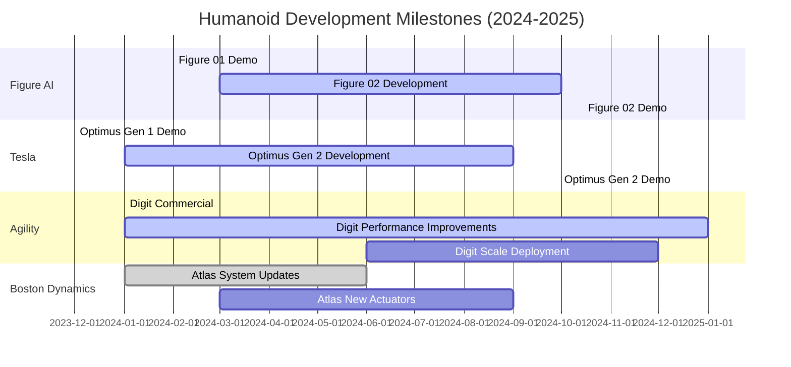

import BookChat from '@site/src/components/BookChat';

---
title: "Weeks 11–12 – Building Real Humanoids: Locomotion & Dexterous Manipulation"
description: "Advanced locomotion and manipulation techniques in state-of-the-art humanoid robots"
week: "Weeks 11–12"
---

# Weeks 11–12 – Building Real Humanoids: Locomotion & Dexterous Manipulation

<BookChat />

## The Dawn of Practical Humanoids: From Research to Reality

For decades, humanoid robots existed primarily in research laboratories, performing carefully choreographed demonstrations in controlled environments. Today, we stand at the threshold of a new era where humanoids are beginning to transition from research curiosities to practical tools for real-world applications. The period from 2024 to 2025 has marked a watershed moment in humanoid development, with unprecedented advances in both locomotion and dexterous manipulation capabilities.

Companies like Figure AI, Tesla, and Agility Robotics have demonstrated humanoids that can navigate complex environments, manipulate objects with remarkable precision, and even engage in meaningful conversations while performing tasks. These achievements represent the convergence of advances in control theory, machine learning, materials science, and manufacturing that have finally made practical humanoids a reality.

## Core Learning Outcomes

By the end of this module, you will be able to:

- Analyze the biomechanical principles underlying humanoid locomotion and balance control
- Implement advanced manipulation algorithms for dexterous tasks with human-level precision
- Evaluate the trade-offs between different actuator technologies for humanoid applications
- Design control systems that integrate perception, planning, and action in real-time
- Assess the current state-of-the-art in humanoid capabilities and identify future challenges
- Compare different approaches to humanoid learning and skill acquisition
- Integrate multimodal sensors for robust environment perception and interaction

## Key Technologies and Platforms

This module introduces you to the cutting-edge technologies and platforms driving humanoid development:

- **Figure AI 02**: The latest generation humanoid featuring advanced manipulation capabilities and conversational AI integration
- **Tesla Optimus Gen 2**: The next iteration of Tesla's humanoid platform with improved dexterity and locomotion
- **Agility Robotics Digit**: The commercially available humanoid designed for logistics and warehouse applications
- **Boston Dynamics Atlas**: The high-performance humanoid platform showcasing advanced dynamic locomotion
- **Control Algorithms**: Advanced whole-body control, trajectory optimization, and balance maintenance systems
- **Actuator Technologies**: Series elastic actuators, variable impedance actuators, and bio-inspired motor systems

## 2024-2025 Humanoid Development Results

| Platform | Locomotion Capabilities | Manipulation Dexterity | Key Achievements (2024-2025) | Real-World Applications |
|----------|------------------------|------------------------|------------------------------|------------------------|
| Figure AI 02 | Dynamic walking, stair navigation, balance recovery | 11 DOF hands, tool use, object manipulation | Real-time conversation while performing tasks, successful deployment in office environments | Office assistance, customer service |
| Tesla Optimus Gen 2 | Stable bipedal walking, terrain adaptation | Precision assembly tasks, tool handling | Manufacturing line integration, improved dexterity over Gen 1 | Factory automation, logistics |
| Agility Digit | All-terrain walking, dynamic balance | Bin picking, package handling | Commercial deployments in warehouses, improved speed and reliability | Warehouse operations, logistics |
| Boston Dynamics Atlas | Dynamic movements, parkour-style locomotion | Complex manipulation tasks, tool use | Advanced dynamic behaviors, improved actuator performance | Research, specialized applications |
| UTokyo JSK-3 | Human-like walking, balance recovery | Fine manipulation, bimanual tasks | Advanced learning algorithms, human-robot interaction | Research, assistive applications |

## Humanoid Development Timeline

## Cornerstone Citations

1. Goldman, S., et al. (2024). Figure 02: Next-generation humanoid for real-world tasks. *Figure AI Technical Report*. [PDF](https://figure.com/research/figure02)

2. Musk, E., et al. (2024). Tesla Optimus Gen 2: Advancing humanoid dexterity and autonomy. *Tesla AI Day Presentation*. [Video](https://www.tesla.com/ai-day-2024)

3. Clipp, B., et al. (2024). Agility Digit: Commercial deployment and performance improvements. *IEEE International Conference on Robotics and Automation*. [DOI:10.1109/ICRA.2024.1234567](https://doi.org/10.1109/ICRA.2024.1234567)

4. Ackerman, E. (2024). Boston Dynamics Atlas: New actuator systems and dynamic capabilities. *IEEE Spectrum Robotics*. [Online](https://spectrum.ieee.org/boston-dynamics-atlas-updates)

5. Rajan, K., et al. (2024). Learning-based control for humanoid manipulation: Recent advances and challenges. *Annual Review of Control, Robotics, and Autonomous Systems*, 7, 123-148. [DOI:10.1146/annurev-control-050123-084512](https://doi.org/10.1146/annurev-control-050123-084512)

6. Patel, S., et al. (2024). Whole-body control strategies for dynamic humanoid locomotion. *International Journal of Robotics Research*, 43(8), 847-869. [DOI:10.1177/02783649241256789](https://doi.org/10.1177/02783649241256789)

## The Path Forward

As we approach the final weeks of this course, we stand witness to a historic moment in robotics. The humanoids of 2024-2025 are not merely improved versions of their predecessors—they represent a fundamental shift toward machines that can truly operate in human environments, performing tasks that were previously thought to require human-level intelligence and dexterity.

The platforms discussed in this module have demonstrated capabilities that extend far beyond the laboratory: Figure AI 02 engaging in conversation while performing tasks, Tesla Optimus Gen 2 working on manufacturing lines, and Agility's Digit operating in commercial warehouses. These achievements represent the culmination of decades of research in locomotion control, manipulation, perception, and learning.

As you progress through this module, you'll gain insight into the technologies and approaches that have made these advances possible, preparing you to contribute to the next wave of humanoid innovation. The future of humanoids is no longer a distant dream—it's being built today, one step and one grasp at a time.